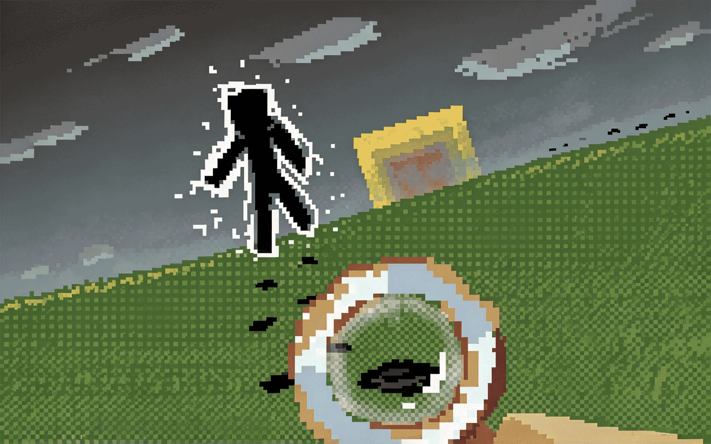

<div align="center">



# Traceable Print

[CurseForge](https://www.curseforge.com/minecraft/mc-mods/traceable-print) · [Modrinth](https://modrinth.com/mod/traceable-print) · [MCMOD.cn](https://www.mcmod.cn/class/31390.html)

[简体中文](README_cn.md) | English

</div>

A multi-platform Minecraft mod that adds **interactable footprint entities**: living entities leave traceable footprints on the ground as they walk, and other players can right-click a footprint to follow the trail step by step until it leads to the creature (or player) that made it.

- This mod is a ground-up rework of the author's earlier particle-based mod [FootprintParticle](https://github.com/Rivmun/FootprintParticle) ⬅️Check it if you want a pure particle, visual, client-only footprint.

- This mod is made by **vibe coding**, then reviewed / tested by human.

## How It Works

### Footprint generation

- Entities leave footprints while **walking on the ground** and at the **moment of landing** — whether from an active jump, tumbling off a ledge, or being knocked back. Both triggers run on the server side; footprints are real entities that are synced and saved with the world.
- To keep walking trails readable and cheap, periodic ground prints are rate-limited: they are only attempted at a fixed interval, and a new footprint is skipped if it spawns **too close to the previous one** — so creeping in place never floods the ground. Landing, by contrast, is detected every tick and ignores that interval, so holding jump while bunny-hopping still leaves a print on every landing (still subject to the minimum-distance gate).
- While **sprinting**, both the spawn interval and the minimum-distance gate shrink to two-thirds, so the trail keeps up with the faster pace instead of thinning out.
- Sneaking entities never leave footprints. Invisible entities (Invisibility potion / invisible flag) can be configured either way.
- Footprints only form on blocks you would plausibly sink a print into: soft ground (low mining hardness) qualifies by default, and any block or block tag can be whitelisted to force-enable prints regardless of hardness.
- Each footprint remembers its **parent entity** and the **next footprint in its chain**, forming one linked trail per creature. The chain pointer is persisted in the entity's NBT, so trails survive unloads, reloads and server restarts.
- Footprints age out on their own after a configurable lifetime — no external cleanup manager is needed. Near the end of their life they visibly **fade out and sink into the ground**.
- Footprints are pure markers: invulnerable, silent, unpushable, and unaffected by gravity. They never physically collide with you (you walk right over them) and explosions do destroy them, which cleanly "breaks" a trail segment.
- A footprint disappears if the ground beneath it is dug away or the block it stands on becomes a full cube (e.g. someone places a block over it).

### Tracing a trail

- **Right-click a footprint with an empty main hand** to highlight the next one in the chain. Repeatedly clicking walks you along the trail; when the last footprint is reached, the **parent entity itself is highlighted** with an outline that only *you* can see — the tracer's client resolves everything locally, so highlighting never touches the network and other players are unaffected.
- **Never in the way when you're working**: a footprint only reacts to your crosshair while your **main hand is empty and you are not sneaking**. Hold any item (or hold sneak) and it becomes fully transparent to the ray — you can break, place, or attack right through the block it sits on, as if the print weren't there. When it *is* clickable, a faint outline in the same style as vanilla's block-selection box marks the footprint under your cursor.
- Only one target is highlighted at a time per player; clicking a new trail silently clears the previous highlight. Clicking the same footprint again just extends the duration.
- While you are tracing, the footprint you clicked emits a slow particle (the same visual as END_ROD) drifting toward the next target once per second, so the direction of the trail stays obvious even when the next footprint is small or hard to spot. This is client-side only and particles cannot pass through blocks.
- A highlighted entity that starts **sneaking** has its highlight cancelled.
- When a trail is followed all the way to a **player**, that player receives an action-bar warning ("Someone is tracing your footsteps...") without revealing who the tracer is (can be disabled). Tracing your own trail gives you a distinct hint instead. Both hints are throttled against spam.
- Broken links are handled gracefully: if the next footprint no longer exists mid-chain (expired / blown up), clicking does nothing misleading — only the true tail of a chain can lead to the parent entity.

### Per-mob appearance

Footprints are not one-size-fits-all. Per entity type you can configure:

- **Side / forward offset** — tune where the print lands relative to the walker (e.g. wide lateral spacing for spiders, forward-reaching prints for horses), so prints match each creature's gait instead of being pinned to a single global offset.
- **Size** — scale the footprint texture per mob (slimes get big prints, cats get small ones). Baby mobs and an entity's own scale multiply on top.
- **Texture** — override the footprint texture per mob, with multiple candidate textures per entry; the server picks one at random when spawning, so left/right feet and different mobs visibly differ. See the texture tutorial below.
- **Block height** — raise prints on blocks whose visual surface sits above their hitbox (snow layers, soul sand, mud...) so they don't get buried.

All of these ship with sensible per-mob defaults out of the box and can be edited in the config GUI or directly in the JSON file.

### Filtering

- Global mode: footprints for **all mobs**, **players only**, or **disabled** entirely.
- Entity list: a per-entity allow/deny list supporting both `namespace:path` IDs and `#namespace:tag` tags, switchable between blacklist and whitelist semantics.
- Block list: a whitelist of blocks/tags that always accept footprints, bypassing the hardness gate.

## Custom Footprint Textures

The default print texture lives at `traceableprint:textures/entity/footprint.png`. To give specific mobs their own footprints:

1. Drop your PNGs anywhere a resource pack can reach — either into a pack under `assets/traceableprint/textures/entity/` (e.g. `assets/traceableprint/textures/entity/animals/paw.png`), or under **your own namespace** for pack authors (e.g. `assets/mypack/textures/entity/ender.png`).
2. Add entries to the `textureList` config (GUI or `config/traceableprint.json`), format:

   ```
   modid:mobid, textureName1, textureName2, ...
   ```

   - `minecraft:cat,paw` → uses `traceableprint:textures/entity/paw.png`
   - `minecraft:enderman,mypack:entity/ender` → full `namespace:path` form; a `path` not starting with `textures/` is completed as `textures/entity/...`, and `.png` may be omitted
   - Multiple candidate names = one is picked at random per spawned footprint (a mob can also have several entries to grow the pool)
3. On a server, the **server's** `textureList` decides which texture is used (the chosen name is synced with the entity). If the synced texture doesn't exist in *your* client's packs, you quietly fall back to the default footprint — never a missing-texture block. In singleplayer both sides read the same file, so there is nothing extra to do.

Names are case-insensitive and whitespace-tolerant; typos are logged once and retried after resource pack reloads (F3+T) without restarting the game.

## Configuration

Everything is tweaked in an easy in-game config screen and saved as plain JSON at `config/traceableprint.json`.

Open the config screen from the mod list (Mod Menu on Fabric, the mod's **Config** button on NeoForge), or from anywhere in-game by typing **`/traceableprintconfig`** in chat — that command works on every platform, including singleplayer. If the config library the screen is built on (Cloth Config) isn't installed, the mod shows a friendly screen telling you so instead of erroring out.

On **dedicated servers**, two commands are available (op level 2 required):

- `/traceableprint setEnable off|player|all` — switch the global mode.
- `/traceableprint upload` — pull the *executing player's* client config and apply it to the server.

## Credits

- **Rimo(Rivmun)** — author of this mod.
- Built on the [Stonecutter](https://stonecutter.kikugie.dev/) + [architectury-loom](https://github.com/architectury/architectury-loom) multi-version modding workflow.
- AI assistance mainly by Qwen3.8-Flash @ [QoderCN](https://www.aliyun.com/product/lingma).
- Distributed under the [GNU General Public License v3.0](LICENSE).
