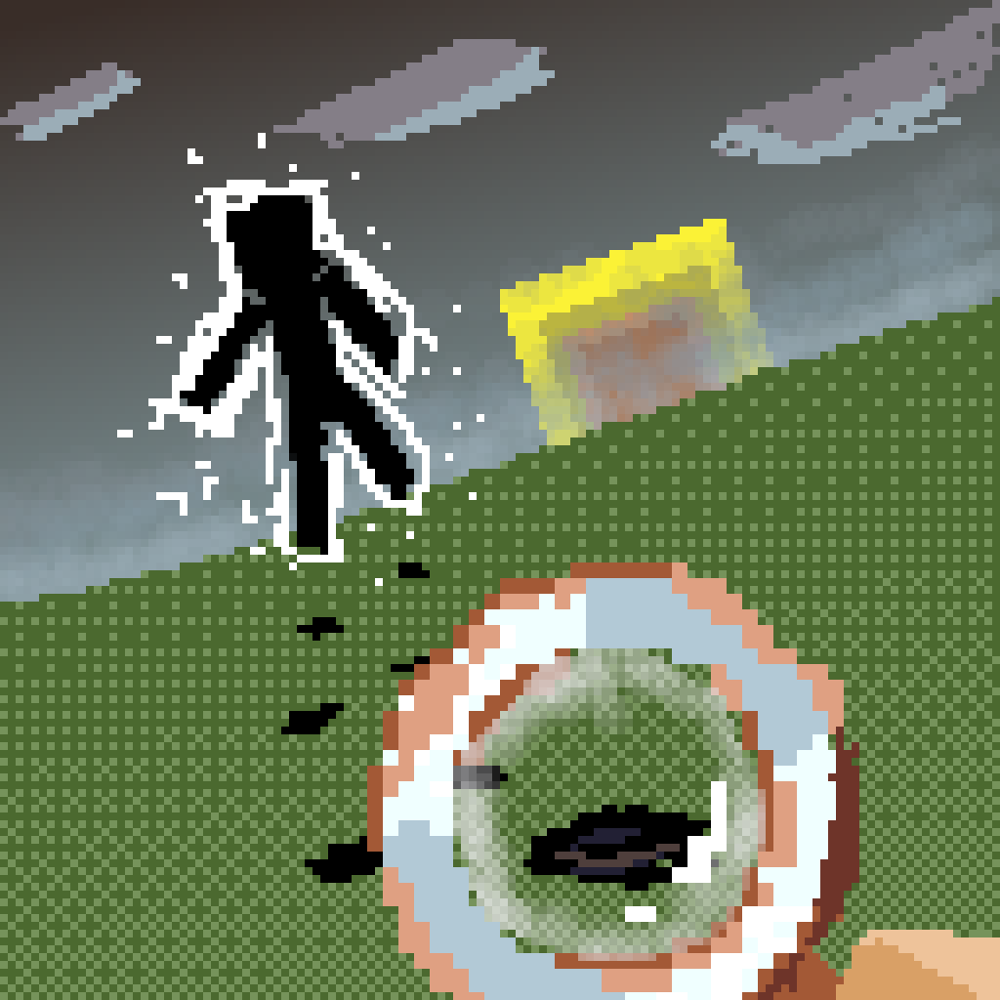

<div align="center">



# Traceable Print

[CurseForge](https://www.curseforge.com/minecraft/mc-mods/traceable-print) · [Modrinth](https://modrinth.com/mod/traceable-print)

简体中文 | [English](README.md)

</div>

一个跨平台的 Minecraft 模组，加入了**可交互的脚印实体**：活体生物在地面行走时会留下可追踪的脚印，其他玩家可以右键点击脚印，顺着痕迹一步步追踪，直到找到留下它的生物（或玩家）。

- 本模组是作者早期粒子向模组 [FootprintParticle](https://github.com/Rivmun/FootprintParticle) 的重写之作 ⬅️如果你只想要纯粒子、纯观感、纯客户端的脚印，可以看看那个。

- 本模组由 **vibe coding** 产出，再经由人工审阅 / 实测。

## 工作原理

### 脚印生成

- 生物在**地面行走**时以及**落地的瞬间**都会留下脚印——无论是主动跳跃、从崖边滚落，还是被击飞。两种触发都在服务端执行；脚印是真正的实体，会同步并随世界一起存档。
- 为了让行走轨迹既清晰又廉价，周期性产生的地面脚印受速率限制：只按固定间隔尝试生成，并且当新脚印与上一个**距离过近**时会被跳过——所以原地磨蹭不会铺满地面。相比之下，落地检测每 tick 都执行且忽略该间隔，因此连续跳跃（bunny-hopping）每次落地都会留下脚印（但仍受最小间距闸门约束）。
- **疾跑**时，生成间隔与最小间距闸门都会缩小到三分之二，让轨迹跟得上更快的步伐，而不是越来越稀疏。
- 潜行的生物永不留下脚印。隐身实体（隐身药水 / 隐身标记）可以被配置为任一种处理方式。
- 脚印只在「理应能压出印子」的方块上形成：松软地面（挖掘硬度低）默认合格，你也可以把任意方块或方块标签加入白名单，无视硬度强制允许生成。
- 每个脚印都记得自己的**父实体**以及链中的**下一个脚印**，从而为每只生物串成一条完整的轨迹链。链指针持久化在实体的 NBT 中，因此轨迹能扛得住区块卸载、重载与服务器重启。
- 脚印会在可配置的存活时间结束后自行消失——不需要额外的清理管理器。临近生命末期时，它们会明显地**淡出并沉入地面**。
- 脚印只是标记物：无敌、无声、不可被推动、不受重力影响。它们绝不会与你发生物理碰撞（你可以直接走过去），但爆炸会摧毁它们，从而干净地「切断」一段轨迹。
- 如果脚印下方的地面被挖掉，或它所在的方块变成了完整方块（例如有人在上面放了方块），脚印就会消失。

### 追踪足迹

- **用空主手右键点击脚印**即可高亮链中的下一个脚印。反复点击就能沿着轨迹一路前进；当到达最后一个脚印时，**父实体会被描边高亮**，而这条描边只有*你*看得见——追踪者的客户端在本地解析全部信息，因此高亮从不走网络，也不影响其他玩家。
- **干活时绝碍事**：只有当你的**主手为空且没有潜行**时，脚印才会响应你的准星。只要手持任意物品（或按住潜行），它对射线就完全透明——你可以在它所在的方块上正常破坏、放置或攻击，就当它不存在。当它*确实*可点击时，一个与原版方块选框同风格的淡描边会标出准星下的脚印。
- 每位玩家同时只会高亮一个目标；点击新的轨迹会静默清除上一次的高亮。重复点击同一个脚印只是延长其持续时间。
- 追踪过程中，你点击的脚印每秒会释放一个缓慢飘向下一个目标的粒子（与 END_ROD 同款视觉表现），即使下一个脚印很小或难以发现，轨迹方向也始终一目了然。这部分完全是客户端行为，且粒子无法穿过方块。
- 被高亮的实体一旦开始**潜行**，其高亮会被取消。
- 当一条轨迹被一路追到**玩家**身上时，该玩家会收到一条 action bar 提示（“有人在追踪你的脚印……”），且不会暴露追踪者是谁（可关闭）。追踪自己的轨迹则会收到一条不同的提示。两种提示都做了防刷屏节流。
- 断链处理得当：如果链中的下一个脚印已不存在（过期 / 被炸毁），点击不会给出误导性反馈——只有链条真正的末端才可能指向父实体。

### 按生物定制外观

脚印不是一刀切的。你可以按实体类型配置：

- **侧向 / 前后偏移** —— 调整脚印相对行走者的落点（例如蜘蛛给较大的横向间距，马给前伸的脚印），让印子贴合每种生物的步态，而不是钉死在一个全局偏移上。
- **大小** —— 按生物缩放脚印贴图（史莱姆大脚印，猫小脚印）。幼年个体的缩放与实体自身的 scale 会在此基础上继续叠加。
- **贴图** —— 按生物覆盖脚印贴图，每个条目可提供多个候选贴图；服务端在生成时随机选一张，因此左右脚与不同生物之间肉眼可辨。详见下文的贴图教程。
- **方块高度** —— 对视觉表面高于碰撞箱的方块（雪层、灵魂沙、泥巴……）抬升脚印，避免被埋。

以上都自带合理的按生物默认值，可以在游戏内配置界面里编辑，也可以直接改 JSON 文件。

### 过滤

- 全局模式：为**所有生物**生成脚印、**仅玩家**、或完全**关闭**。
- 实体列表：按实体的放行 / 拦截列表，同时支持 `namespace:path` ID 与 `#namespace:tag` 标签，并可在黑名单与白名单语义之间切换。
- 方块列表：一份方块/标签白名单，始终接受脚印，绕过硬度闸门。

## 自定义脚印贴图

默认贴图位于 `traceableprint:textures/entity/footprint.png`。要给特定生物换用自己的脚印：

1. 把 PNG 放进资源包能读到的任意位置 —— 要么放进某个资源包的 `assets/traceableprint/textures/entity/` 下（例如 `assets/traceableprint/textures/entity/animals/paw.png`），要么（给资源包作者）放在**你自己的命名空间**下（例如 `assets/mypack/textures/entity/ender.png`）。
2. 在 `textureList` 配置里添加条目（GUI 或 `config/traceableprint.json`），格式为：

   ```
   modid:mobid, textureName1, textureName2, ...
   ```

   - `minecraft:cat,paw` → 使用 `traceableprint:textures/entity/paw.png`
   - `minecraft:enderman,mypack:entity/ender` → 完整 `namespace:path` 写法；不以 `textures/` 开头的 `path` 会被补全为 `textures/entity/...`，且 `.png` 后缀可省略
   - 多个候选名 = 每个生成的脚印随机取一个（同一生物也可以写多个条目来扩充候选池）
3. 在服务器上，由**服务端**的 `textureList` 决定使用哪张贴图（选中的名字会随实体一起同步）。如果同步来的贴图在你的客户端资源包里不存在，你会静默回退到默认脚印 —— 绝不会出现缺失贴图方块。单机下两侧读的是同一个文件，因此无需额外操作。

名字不区分大小写，也容忍多余空白；写错的名字只会被记录一次告警，并且在资源包重载（F3+T）后自动重试，无需重启游戏。

## 配置

所有参数都能在易用的游戏内配置界面里调整，并以纯 JSON 存到 `config/traceableprint.json`。

可以从模组列表打开配置界面（Fabric 上用 Mod Menu，NeoForge 上用模组自带的 **Config** 按钮），或者在游戏内任意时刻输入 **`/traceableprintconfig`** —— 该命令在所有平台都可用，单人模式也不例外。如果该界面依赖的配置库（Cloth Config）没有安装，模组会显示一个友好的提示界面，而不是直接报错。

在**专用服务器**上，有两条命令可用（需要 op 等级 2）：

- `/traceableprint setEnable off|player|all` —— 切换全局模式。
- `/traceableprint upload` —— 拉取*执行该命令的玩家*的客户端配置并应用到服务器。

## 致谢

- **Rimo(Rivmun)** —— 本模组作者。
- 基于 [Stonecutter](https://stonecutter.kikugie.dev/) + [architectury-loom](https://github.com/architectury/architectury-loom) 的多版本模组开发工作流。
- AI 辅助主要来自 Qwen3.8-Flash @ [QoderCN](https://www.aliyun.com/product/lingma)。
- 以 [GNU General Public License v3.0](LICENSE) 分发。
